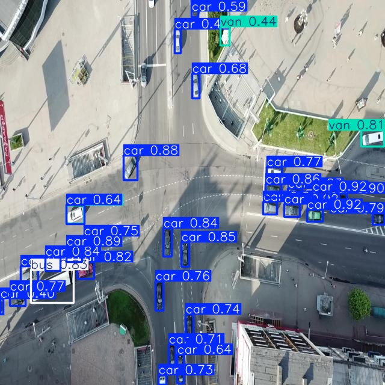
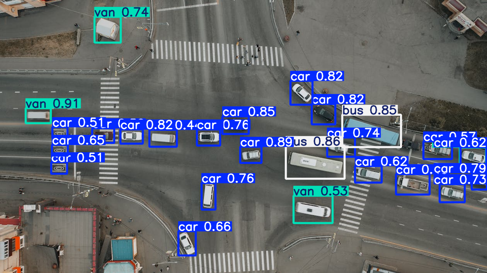
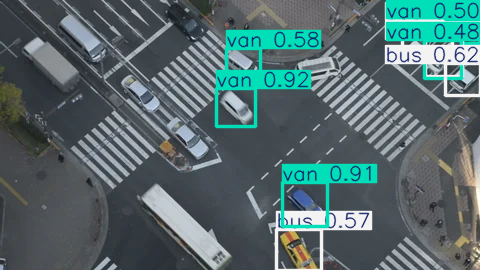

# Тестове завдання

Проєкт має два файли:

[**Аналіз та інференс (main.ipynb)**](https://github.com/VoDzYiT/YoloTestTask/blob/master/main.ipynb): тут проведено детальний аналіз вхідних даних, перевірку моделі на тестовій вибірці та візуалізацію прогнозів.

[**Навчання моделі (model_training.ipynb)**](https://github.com/VoDzYiT/YoloTestTask/blob/master/model_training.ipynb): файл з навчанням моделі, я навчав в колабі.

### Декілька прикладів передбачення (інші присутні в main)

Тестові дані з датасету:

Зовнішні дані не з датасету

